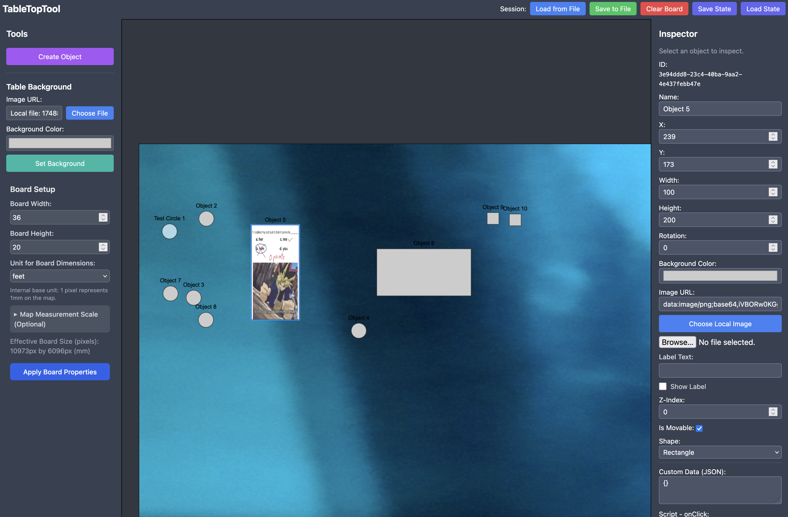

# TableTopTool - Offline MVP

A web-based, generic, and extensible virtual tabletop (VTT) designed to support a wide array of tabletop games. This MVP version operates in an **offline-first, in-memory mode**, with all state managed locally and saved/loaded via JSON files. Firebase integration is stubbed for potential future use. The codebase has been recently updated to use modern ES6+ JavaScript syntax and features, enhancing readability and maintainability. It utilizes Tailwind CSS for styling.


[Screenshot](/docs/TTTScreenshot.png)

## Prerequisites

- **Node.js**: `>=22.0.0` recommended. Download from [nodejs.org](https://nodejs.org/).
- **npm**: Usually comes with Node.js.

## Setup

For detailed setup instructions, including cloning, dependency installation, environment variables, and running the development server, please see the [Developer Setup Guide](./docs/developer_setup.md).

## Available Scripts

- **Run the Development Server:**

     ```bash
     npm run dev
     ```

     This will start the Vite development server (usually on `http://localhost:5173` or the next available port) and automatically open the application in your default web browser. Hot module replacement is enabled.

- **Build for Production:**

     ```bash
     npm run build
     ```

     This command bundles the application for production. The output files will be placed in the `dist/` directory.

- **Linting:**
     ```bash
     npm run lint
     ```
     Runs ESLint to check for code quality and style issues in JavaScript files within `src/` and `config/` directories. It will attempt to fix issues automatically.

- **Formatting:**
     ```bash
     npm run format
     ```
     Formats code in `src/` and `config/` directories using Prettier through `prettier-eslint-cli`.

## Project Structure

The application follows an MVVM (Model-View-ViewModel) architecture.

- `src/`: Contains all the primary source code for the application.
    - `index.html`: The main HTML file for the application.
    - `main.js`: The main entry point. Initializes logging and delegates application setup to `uiView.js`.
    - `style.css`: Main stylesheet, incorporating Tailwind CSS.
    - `api.js`: Defines the `VTT_API`, providing a stable interface for interacting with the data model. Used by ViewModels and object scripts.
    - `firebase.js`: Firebase integration (currently in offline/stubbed mode).
    - `loggingConfig.js`: Initializes and configures the `loglevel` library.
    - `session_management.js`: Handles saving and loading of table states (to file and browser memory).
    - `model/`: Contains the core data structures and logic.
        - `model.js`: The central data store. Manages objects, board state, and dispatches `modelChanged` events.
        - `VTTObject.js`: Defines the `VTTObject` class for all items on the tabletop.
        - `Board.js`: Defines the `Board` class for managing canvas-wide properties (pan, zoom, background, dimensions).
    - `viewmodels/`: Contain the state and logic for the views.
        - `canvasViewModel.js`: Manages state for the canvas display (objects, pan/zoom, background, selection, image loading).
        - `uiViewModel.js`: Manages state for UI elements outside the canvas (inspector, modals, board settings).
    - `views/`: Responsible for rendering UI and handling user interactions.
        - `canvasView.js`: Renders the canvas and handles canvas-specific user input.
        - `uiView.js`: Initializes and manages other UI elements (toolbar, inspector, modals), and orchestrates ViewModel interactions.
        - `components/`: Contains individual UI components (e.g., `boardSettingsView.js`, `inspectorView.js`).
    - `public/`: Static assets that are copied directly to the build output's root.
        - `.gitkeep`: Placeholder for an empty directory.
        - `android-chrome-192x192.png`, `android-chrome-512x512.png`, `apple-touch-icon.png`, `favicon-16x16.png`, `favicon-32x32.png`, `favicon.ico`, `site.webmanifest`: Favicons and web manifest files.
- `config/`: Contains configuration files for various tools and environments.
    - `.env.development`, `.env.production`, `.env.test`: Environment-specific variables (e.g., for Firebase, log levels). Loaded by Vite.
    - `.prettierrc.json`: Configuration for Prettier.
    - `babel.config.json`: Configuration for Babel.
    - `cypress.config.js`: Configuration for Cypress testing.
    - `postcss.config.js`: Configuration for PostCSS (used by Tailwind CSS).
    - `tailwind.config.js`: Configuration for Tailwind CSS.
- `docs/`: Contains supplementary documentation.
- `eslint.config.js`: Configuration for ESLint.
- `package.json`: Defines project metadata, dependencies, and scripts.
- `vite.config.js`: Configuration for the Vite development server and build process. It specifies `src` as the root and `src/public` as the public directory.
- `.gitignore`: Specifies intentionally untracked files that Git should ignore.
- `install.sh`: Installation script (review if its contents are still relevant or need documenting).

## Developer Guide

This project includes resources to help developers get started and test the application:

- **[Developer Setup Guide](./docs/developer_setup.md):** Instructions on how to set up your local development environment.
- **[Testing Guide](./docs/testing_guide.md):** A checklist and guide for manually testing the application's features.

## Core Features (Offline MVP)

- **Object Creation & Manipulation**: Create and modify objects (rectangles, circles) on a 2D canvas.
- **Inspector Panel**: View and edit properties of selected objects (e.g., position, size, rotation, color, image URL, custom data, scripts).
- **Canvas Controls**: Pan and zoom the canvas for easy navigation.
- **Customizable Background**: Set the table background to a solid color or an image URL.
- **Local Save/Load**:
     - Save the entire table state (including all objects, their properties, background settings, and view state) to a `.ttt.json` file on your local machine.
     - Load a previously saved table state from a `.ttt.json` file.
- **Basic Scripting**: Attach `onClick` scripts to objects. These scripts can use the `VTT_API` to:
     - Log messages to the console (`VTT.log()`).
     - Read other object data (`VTT.getObject()`).
     - Update an object's custom data (`VTT.updateObjectState()`).

---
